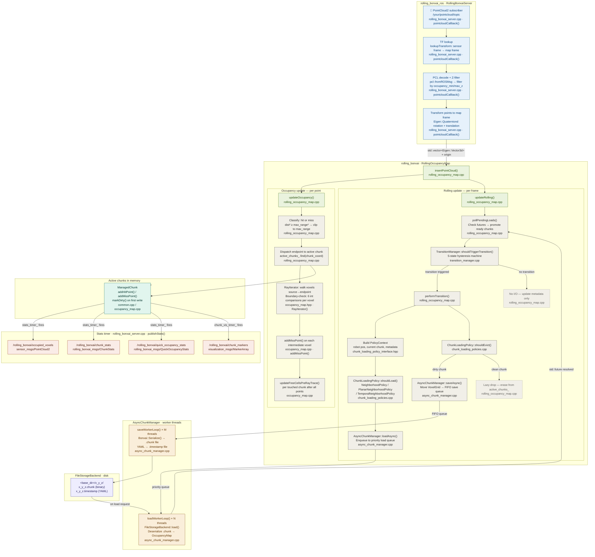

# Rolling-Bonxai

> **V2 — Current stable branch**

**Rolling-Bonxai** is a C++ 17 implementation built on top of Bonxai:https://github.com/facontidavide/Bonxai. Memory remains a bottleneck for resource constrained robots (like drones) that have to map and navigate in very large areas. In these large areas, **the robot will likely not need other parts of the map besides some local area to do path planning/local planning**. Therefore, these storing unnecessary parts of the map in memory is wasteful. **Rolling Bonxai** implements a chunking system (like in games) comprising of *NxNxN* voxels each. Each chunk is a `Bonxai::OccupancyGrid` that can be loaded/created or offloaded depending on the robot's position. Unused parts of the maps are serialized and saved to disk and loaded when required depending on a user defined policy. The underlying Bonxai library implements a compact hierarchical data structure that can store and manipulate volumetric data, discretized as Voxel Grids in a manner that is both **sparse** and **unbounded**. Star this repo if you found this useful/interesting :)

## Rolling-Bonxai In Action
### 1. Position-based chunk eviction


Full Video Here: https://youtu.be/gStI7W-x3mM

**Green and Blue semi-transparent cubes are "Dirty" and "Clean" chunks**. Dirty chunks are those that have been updated since the last time it was loaded into memory, while clean ones have not. Chunks that contain voxels are dirty. As the sensor moves, chunks are evicted based on some **policy**. In this case, it is a position based policy, where **chunks that are not one of the 26 neibors of the current chunk are evicted from memory**.

### 2. Position-based chunk loading from disc


Full Video Here: https://youtu.be/h4DjMLnnrf4

## Table of Contents

1. [Prerequisites](#prerequisites)
2. [Launching Rolling Bonxai](#launching-rolling-bonxai)
3. [Parameter Reference](#parameter-reference)
4. [Architecture Overview](#architecture-overview)
5. [Data Flow Diagram](#data-flow-diagram)

---

## Prerequisites

Rolling Bonxai requires a **point cloud source** published as a `sensor_msgs/PointCloud2` topic in the ROS 2 graph. This is typically provided by a depth camera (e.g., ZED2i) or a LiDAR sensor. You must configure `topic_in` to match the topic your sensor is publishing on, and ensure TF transforms are available from your sensor frame to the `frame_id` (map frame).

**Required ROS 2 packages and dependencies:**

- `bonxai_core`, `bonxai_map`, `rolling_bonxai`, `rolling_bonxai_msgs`
- `rclcpp`, `sensor_msgs`, `tf2_ros`, `pcl_conversions`
- `yaml-cpp`

Build your workspace with:

```bash
colcon build --packages-select bonxai_core bonxai_map rolling_bonxai rolling_bonxai_msgs rolling_bonxai_ros
source install/setup.bash
```

---

## Launching Rolling Bonxai

### Option 1: As a Composable Node (Recommended for Production)

The composable node option runs `RollingBonxaiServer` inside an `rclcpp_components` container, enabling **zero-copy intra-process communication** when combined with other composable nodes (e.g., the ZED camera wrapper).

```bash
ros2 launch rolling_bonxai_ros rolling_bonxai_mapping.launch.py
```

You can override the container name and Foxglove visualization port:

```bash
ros2 launch rolling_bonxai_ros rolling_bonxai_mapping.launch.py \
  container_name:=my_container \
  foxglove_port:=8765
```

The launch file will:
1. Start an `rclcpp_components` container
2. Load `RollingBonxai::RollingBonxaiServer` into that container
3. Start a Foxglove Bridge for visualization

> **Point cloud source:** The node subscribes to the topic defined in `topic_in` (default: `/zed/zed_node/point_cloud/cloud_registered`). Make sure your sensor driver is running and publishing to this topic before or alongside this launch file.

### Option 2: As a Standalone Executable

For simpler setups or debugging, run the standalone binary directly:

```bash
ros2 run rolling_bonxai_ros rolling_bonxai_server_node \
  --ros-args --params-file /path/to/rolling_bonxai_params.yaml
```

Or pass parameters individually:

```bash
ros2 run rolling_bonxai_ros rolling_bonxai_server_node \
  --ros-args \
  -p frame_id:=map \
  -p topic_in:=/your/pointcloud/topic \
  -p occupancy.resolution:=0.05
```

### Option 3: Using a Params File

The recommended way to configure the node is to provide a YAML parameters file (see `rolling_bonxai_ros/params/rolling_bonxai_params.yaml` as a template):

```bash
ros2 run rolling_bonxai_ros rolling_bonxai_server_node \
  --ros-args --params-file rolling_bonxai_params.yaml
```

---

## Parameter Reference

All parameters are scoped under `rolling_bonxai_server_node/ros__parameters/`. The YAML hierarchy below mirrors the parameter file structure.

### Core Frame & Topic

| Parameter | Type | Default | Unit / Significance |
|-----------|------|---------|---------------------|
| `frame_id` | string | `"map"` | The global fixed frame. All map data is stored in this frame. |
| `base_frame_id` | string | `"base_footprint"` | The robot base frame used for TF lookups. |
| `topic_in` | string | `"/points"` | The `sensor_msgs/PointCloud2` topic to subscribe to. **Must match your sensor's output topic.** |

### Occupancy Settings (`occupancy.*`)

| Parameter | Type | Default | Unit / Significance |
|-----------|------|---------|---------------------|
| `occupancy.resolution` | double | `0.05` | **Meters (m).** Side length of each cubic voxel. Smaller = finer detail but higher memory usage. Typical range: 0.02–0.2 m. |
| `occupancy.occupancy_min_z` | double | `-100.0` | **Meters (m).** Points below this Z coordinate (in the map frame) are discarded before insertion. Useful to cut out the ground or underground clutter. |
| `occupancy.occupancy_max_z` | double | `100.0` | **Meters (m).** Points above this Z coordinate are discarded. Useful to remove ceiling returns or high-altitude noise. |
| `occupancy.occupancy_threshold` | double | `0.50` | **Unitless probability [0, 1].** A voxel with log-odds corresponding to this probability is considered on the boundary between occupied and free. Voxels above this are occupied; below are free. The default of 0.5 means equal probability. |

### Sensor Model (`sensor_model.*`)

These parameters control the Bayesian occupancy update. All probability values are converted internally to log-odds with a fixed-point scale of 1×10⁶.

| Parameter | Type | Default | Unit / Significance |
|-----------|------|---------|---------------------|
| `sensor_model.max_range` | double | `30.0` | **Meters (m).** Points beyond this range are clipped to the maximum range and treated as free-space measurements rather than hits. |
| `sensor_model.hit` | double | `0.7` | **Unitless probability [0, 1].** Probability that a voxel is occupied given a sensor return. Higher values make the map respond faster to obstacles but may cause noise. |
| `sensor_model.miss` | double | `0.4` | **Unitless probability [0, 1].** Probability of occupancy given a ray passes through without a return. Lower values clear free space more aggressively. |
| `sensor_model.min` | double | `0.12` | **Unitless probability [0, 1].** Minimum clamping probability. Prevents a voxel from ever being considered more free than this. Stops the map from being over-confident about free space. |
| `sensor_model.max` | double | `0.97` | **Unitless probability [0, 1].** Maximum clamping probability. Prevents a voxel from becoming more occupied than this. Allows obstacles to eventually be cleared if the sensor reports free space there. |

### Rolling / Coordinate System (`rolling.coordinate_system.*`)

| Parameter | Type | Default | Unit / Significance |
|-----------|------|---------|---------------------|
| `rolling.coordinate_system.chunk_size` | double | `5.0` | **Meters (m).** The side length of each cubic chunk. Each chunk wraps one `OccupancyMap`. Larger chunks reduce I/O frequency but increase per-chunk memory. Typical range: 2–20 m. |

### Rolling / Transition Manager (`rolling.transition_manager.*`)

| Parameter | Type | Default | Unit / Significance |
|-----------|------|---------|---------------------|
| `rolling.transition_manager.hysteresis_ratio` | double | `0.2` | **Unitless [0.01, 1.0].** Fraction of `chunk_size` that the robot must penetrate into a new chunk before a chunk transition is confirmed. For example, with `chunk_size=5.0` and `hysteresis_ratio=0.2`, the robot must travel 1.0 m into the new chunk before any load/evict cycle fires. Higher values reduce I/O thrashing near boundaries at the cost of slightly delayed chunk loading. |

### Rolling / Loading Policy (`rolling.loading_policy.*`)

| Parameter | Type | Default | Unit / Significance |
|-----------|------|---------|---------------------|
| `rolling.loading_policy.name` | string | `"neighbourhood"` | **Unitless string.** Selects the chunk management strategy. Options: `"neighbourhood"`, `"planar"`, `"temporal"`. |

**Neighbourhood Policy** (`rolling.loading_policy.neighborhood.*`):

| Parameter | Type | Default | Unit / Significance |
|-----------|------|---------|---------------------|
| `neighborhood.radius` | int | `2` | **Unitless (chunks).** Chebyshev radius — loads all chunks within this many chunk-lengths in every direction. Radius 1 → 26 neighbours; radius 2 → 124 neighbours. Increase for faster robots. |

**Planar Policy** (`rolling.loading_policy.planar.*`):

| Parameter | Type | Default | Unit / Significance |
|-----------|------|---------|---------------------|
| `planar.radius` | int | `1` | **Unitless (chunks).** Horizontal (XY-plane) Chebyshev radius. Same as neighbourhood radius but applied only on the ground plane. |
| `planar.z_min` | int | `0` | **Unitless (chunks).** Under `use_relative=false`: minimum absolute Z chunk coordinate to keep loaded. Under `use_relative=true`: number of chunks *below* the ego to keep loaded (must be ≥ 0). |
| `planar.z_max` | int | `2` | **Unitless (chunks).** Under `use_relative=false`: maximum absolute Z chunk coordinate. Under `use_relative=true`: number of chunks *above* the ego to keep loaded (must be ≥ 0). |
| `planar.use_relative` | bool | `false` | **Unitless boolean.** If `true`, `z_min` and `z_max` are relative offsets from the robot's current Z chunk rather than absolute chunk coordinates. Recommended for ground robots that operate at varying elevations. |

**Temporal Policy** (`rolling.loading_policy.temporal.*`):

| Parameter | Type | Default | Unit / Significance |
|-----------|------|---------|---------------------|
| `temporal.radius` | int | `2` | **Unitless (chunks).** Chebyshev radius, same as neighbourhood. |
| `temporal.age_weightage` | double | `0.3` | **Unitless [0.0, 1.0].** Blend factor between distance-based priority (0.0) and age-based priority (1.0). A value of 0.3 means 70% distance priority + 30% freshness priority when ordering load requests. |
| `temporal.max_age_s` | int | `300` | **Seconds (s).** Chunks older than this are considered stale and excluded from loading. Useful in dynamic environments. |

### Rolling / Storage (`rolling.storage.*`)

| Parameter | Type | Default | Unit / Significance |
|-----------|------|---------|---------------------|
| `rolling.storage.full_save_folder_path` | string | `""` | **Unitless path string.** Full filesystem path where chunk files (`.chunk`) and timestamp files (`.timestamp`) are saved to and loaded from. Must be readable and writable by the process. Example: `"/home/robot/bonxai_chunks"`. |

### Rolling / Async I/O (`rolling.asyncio.*`)

| Parameter | Type | Default | Unit / Significance |
|-----------|------|---------|---------------------|
| `rolling.asyncio.enable_io` | bool | `false` | **Unitless boolean.** Master switch for disk I/O. When `false`, chunks are never saved or loaded from disk — the map is purely in-memory. Set to `true` for persistent, large-area mapping. |
| `rolling.asyncio.num_load_threads` | int | `3` | **Unitless (thread count).** Number of dedicated worker threads for loading chunks from disk. Higher values allow more concurrent loads but consume more CPU. |
| `rolling.asyncio.num_save_threads` | int | `1` | **Unitless (thread count).** Number of dedicated worker threads for saving chunks to disk. Saves are naturally serialised per-chunk (different files), so 1 is usually sufficient. |

### Server (`server.*`)

| Parameter | Type | Default | Unit / Significance |
|-----------|------|---------|---------------------|
| `server.cleanup_interval_sec` | double | `300.0` | **Seconds (s).** How often the `/rolling_bonxai/clean_memory` maintenance cycle should be offered. Note: cleanup is actually triggered via the `/rolling_bonxai/clean_memory` service call; this setting is retained for future automatic scheduling. |

### Stats / Visualization (`stats.*`)

| Parameter | Type | Default | Unit / Significance |
|-----------|------|---------|---------------------|
| `stats.enable_stats` | bool | `true` | **Unitless boolean.** Enables statistics publishers and the occupied-voxel point cloud publisher. Disable to reduce CPU overhead in production. |
| `stats.quick_stats` | bool | `true` | **Unitless boolean.** If `true`, only fast O(1) statistics are published (cell counts, memory). If `false`, full per-cell iteration is run (bounding box, probability distributions) — expensive at high map sizes. |
| `stats.publish_occupied_voxels` | bool | `true` | **Unitless boolean.** Publishes a `sensor_msgs/PointCloud2` of all currently occupied voxels on `/rolling_bonxai/occupied_voxels`. Disable if bandwidth is a concern. |
| `stats.publish_rate` | double | `3.0` | **Hertz (Hz).** Rate at which statistics and the occupied-voxel cloud are published. |

---

## Architecture Overview

Rolling Bonxai is organized into a layered package hierarchy. `bonxai_core` (external, by Davide Faconti) provides the fundamental sparse voxel grid data structure — refer to the [Bonxai repository](https://github.com/facontidavide/Bonxai) for its internals. The packages described here build on top of it.

### `bonxai_map` — Probabilistic Occupancy Map

`bonxai_map` wraps a `Bonxai::VoxelGrid<CellOcc>` to implement a **probabilistic 3D occupancy map** using log-odds representation. Each voxel stores an integer log-odds value (scaled by 1×10⁶ for fixed-point arithmetic) and an `update_id` that prevents multiple updates to the same cell within a single sensor sweep. The `OccupancyMap` class exposes `insertPointCloud()` as the primary update interface: for each incoming point it classifies the endpoint as a hit or miss (based on `max_range`), records the endpoint in a staging buffer, then calls `updateFreeCells()` to ray-trace from the sensor origin through all buffered endpoints, marking intermediate voxels as free. An `Accessor` cache is maintained internally to amortize lookup costs across bulk insertions. The class is move-only; copying is disabled because of its potentially large memory footprint.

### `rolling_bonxai` — The Rolling Engine

`rolling_bonxai` implements the chunking and rolling-window logic. It is composed of six collaborating subsystems:

**`ChunkCoordinateSystem`** defines a center-origin spatial grid where chunk (0,0,0) is centered at world-origin (0,0,0). It converts between world positions (meters), voxel coordinates (`Bonxai::CoordT`), and chunk coordinates (`ChunkCoord`), and provides neighbor enumeration and boundary-distance queries used by the other subsystems.

**`TransitionManager`** runs a 5-state machine (UNINITIALIZED → STABLE_SOURCE → HYSTERESIS_SOURCE → HYSTERESIS_NEXT → STABLE_NEXT) that prevents thrashing at chunk boundaries. A chunk transition is only confirmed — and a load/evict cycle only triggered — when the robot has penetrated `hysteresis_ratio × chunk_size` meters into the geometrically new chunk. Large position jumps (>1 chunk) bypass hysteresis to handle localization resets.

**`ChunkLoadingPolicy`** is a pure-virtual interface with three built-in implementations: `NeighborhoodPolicy` (3D Chebyshev ball), `PlanarNeighborhoodPolicy` (horizontal ball + vertical Z range, for ground robots), and `TemporalNeighborhoodPolicy` (neighborhood filtered by chunk age). Policies answer two questions per candidate chunk: *should it be loaded?* and *what priority should it have in the load queue?*

**`ManagedChunk`** owns a `unique_ptr<OccupancyMap>` for one spatial chunk and tracks a thread-safe `is_dirty_` flag. Accessing the map via `getMutableMap()` automatically marks it dirty. When a chunk is evicted, `transferMapOwnership()` extracts the underlying `VoxelGrid` for serialization without an extra copy.

**`FileStorageBackend`** handles on-disk persistence. Each chunk occupies its own subdirectory (`<base_dir>/<x>_<y>_<z>/`) containing a binary `.chunk` file (Bonxai serialization format) and a YAML `.timestamp` file recording creation, modification, and access times plus access count. The backend is designed to be called from worker threads — since each chunk maps to a different file, concurrent access to different chunks is safe.

**`AsyncChunkManager`** owns the `FileStorageBackend` and two thread pools: a priority queue of load workers (higher-priority chunks load first) and a FIFO queue of save workers. Load requests return `std::future<unique_ptr<OccupancyMap>>`; the main thread polls futures non-blockingly each update cycle via `pollPendingLoads()`. Duplicate load requests are rejected at two layers: the caller checks `active_chunks_` and `pending_loads_`, and the manager checks its internal `pending_loads_` map.

**`RollingOccupancyMap`** is the main orchestrator. Each call to `insertPointCloud()` performs two phases. In the *occupancy update* phase, it converts all points to `Eigen::Vector3d`, classifies each as hit or miss, dispatches endpoints to the correct active chunk, and ray-traces each ray across chunk boundaries using a boundary-check optimization (6 integer comparisons per voxel, chunk recomputed only on crossing). In the *rolling update* phase, it polls pending load futures, evaluates the `TransitionManager`, and — if a transition is triggered — calls `performTransition()` to issue async loads for desired chunks and async saves for evicted dirty chunks.

---

## Data Flow Diagram

The diagram below traces data from the incoming point cloud all the way to disk. Each node states the method and source file where that step lives.



### Node colour key

| Colour | Layer |
|--------|-------|
| Blue | `rolling_bonxai_ros` — ROS 2 entry point |
| Green | `RollingOccupancyMap` — core orchestrator |
| Gray | Per-step detail inside update phases |
| Amber | `AsyncChunkManager` — I/O worker threads |
| Purple | `FileStorageBackend` — disk storage |
| Teal | `ManagedChunk` — active in-memory chunks |
| Coral | Published ROS 2 topics |

### Source file quick-reference

| Method(s) in diagram | File |
|----------------------|------|
| `pointcloudCallback()` | `rolling_bonxai_ros/src/rolling_bonxai_server.cpp` |
| `insertPointCloud()`, `updateOccupancy()`, `updateRolling()`, `pollPendingLoads()`, `performTransition()` | `rolling_bonxai/src/rolling_occupancy_map.cpp` |
| `RayIterator()` | `rolling_bonxai/include/rolling_bonxai/occupancy_map.hpp` |
| `addHitPoint()`, `addMissPoint()`, `updateFreeCellsPreRayTrace()` | `rolling_bonxai/src/occupancy_map.cpp` |
| `TransitionManager::shouldTriggerTransition()` | `rolling_bonxai/src/transition_manager.cpp` |
| `ChunkLoadingPolicy::shouldLoad()`, `shouldEvict()` | `rolling_bonxai/src/chunk_loading_policies.cpp` |
| `PolicyContext` definition | `rolling_bonxai/include/rolling_bonxai/chunk_loading_policy_interface.hpp` |
| `AsyncChunkManager::loadAsync()`, `saveAsync()`, `loadWorkerLoop()`, `saveWorkerLoop()` | `rolling_bonxai/src/async_chunk_manager.cpp` |
| `FileStorageBackend::load()`, `save()` | `rolling_bonxai/src/file_storage_backend.cpp` |
| `ManagedChunk` dirty tracking | `rolling_bonxai/src/common.cpp` |
| `publishStats()`, `publishChunkVisualization()` | `rolling_bonxai_ros/src/rolling_bonxai_server.cpp` |

---

### Policy Selection Quick Reference

| Robot Type | Recommended Policy | Suggested Parameters |
|------------|--------------------|----------------------|
| Aerial drone (any environment) | `neighbourhood` | `radius=1` or `2` |
| Ground robot (flat indoor) | `planar` | `radius=1, z_min=0, z_max=2, use_relative=true` |
| Ground robot (variable elevation) | `planar` | `radius=2, z_min=2, z_max=3, use_relative=true` |
| Fast robot (>3 m/s) | `neighbourhood` | `radius=2` or `3` |
| Dynamic outdoor environment | `temporal` | `radius=2, max_age_s=300, age_weightage=0.3` |

**Radius sizing formula:**

```
radius = ceil(max_velocity_m_s × reaction_time_s / chunk_size_m)
```

For example: 4 m/s robot, 1.5 s reaction, 5 m chunks → `ceil(4 × 1.5 / 5) = ceil(1.2) = 2`.